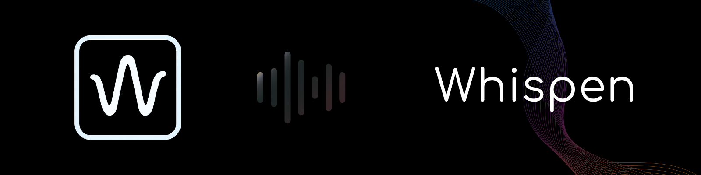

# 📘 Whispen – Modern & Calm PDF Reader



**Whispen** is a modern, minimalist PDF reading app that combines ambient sounds and customizable themes to enhance focus and relaxation.

---

## 🌟 Features

- 📄 Mobile-friendly PDF viewer
- 🎵 Ambient sound support (online & offline)
- 🎨 Theme switching with customizable palettes
- 📚 Library system and recent files history
- 🗣️ Multilingual interface (English, Azerbaijan, Turkish, Russian, Spanish)
- 🔐 Firebase-based login & registration
- ⚙️ Settings panel for volume, language, password, and account options

---

## 🚀 Getting Started

1. Clone the repository:
   ```bash
   git clone https://github.com/samirrhashimov/whispen.git

2. Open index.html in your browser to start using the app.


3. To enable authentication, configure your Firebase settings in:

scripts/firebase-config.js

---

## 🌍 Language Support

🇬🇧 English (Default)

🇦🇿 Azerbaijan

🇪🇸 Spanish

🇹🇷 Turkish

🇷🇺 Russian


---

## 🧩 Developer Guide

Want to add new ambient sounds or themes?
Check out the docs/dev-guide.txt for detailed instructions.


---

## 🛡️ License

This project is licensed under Creative Commons BY-NC-ND 4.0.

Non-commercial use only

No derivative works

Attribution required


Learn more: creativecommons.org/licenses/by-nc-nd/4.0


---

## 🙌 Contributing

Feel free to open issues or submit pull requests.
Whispen welcomes clean code and new ideas!


---

##  📫 Contact

Email: whispen.app@gmail.com

